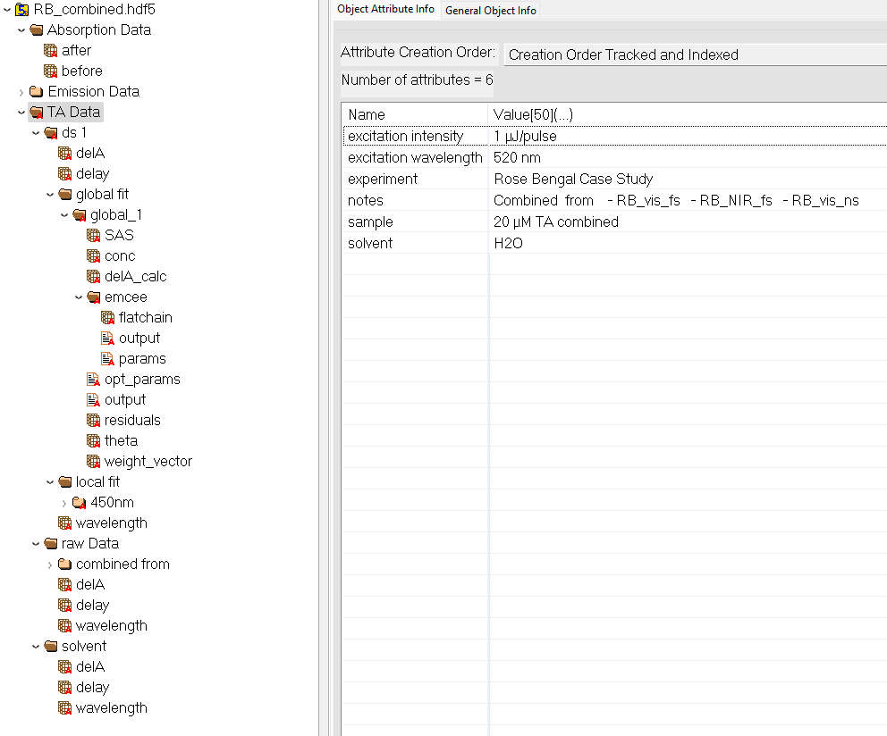

Project & Data Structure
=================

HDF5 Project Files
------------------

Hierarchical Data Format 5 (HDF5) is a portable, binary, self-describing file format designed for storing and organizing large, complex datasets and their metadata in a single container. Unlike flat text formats (e.g., CSV), HDF5 supports nested groups, rich metadata attributes, and compression. These features eliminate the need for multiple sidecar files, avoid parsing errors, and accelerate read/write operations for large arrays. HDF5 files can be explored with graphical tools such as **HDFView** (https://www.hdfgroup.org/downloads/hdfview/) or accessed programmatically through libraries like **h5py** (Python) or the MATLAB HDF5 API. This file format is used by TAPAS to save and load projects.

TAPAS HDF5 Structure
--------------------

Each TAPAS project is serialized into a single HDF5 container with a clear hierarchical layout. Imported TA, solvent and steady-state measurements are stored under ``/raw Data/`` and annotated with experiment-level metadata (sample name, excitation wavelength, acquisition parameters etc.) entered in the Import tab. Preprocessing creates new groups under ``/ds/``. Each dataset references its source raw data and carries attributes recording the sequence of operations (time-zero correction, chirp compensation, trimming, etc.) without modifying the original arrays. Local and global fit results are saved under ``/local fit/`` or ``/global fit/``, respectively, with each fit group pointing to its associated processed dataset. Finally, Bayesian posterior samples from MCMC analysis are stored in ``/emcee/`` subgroups, linked to their parent fit, enabling traceability of every computation step.

   An exemplary TAPAS project file viewed with HDFView.
