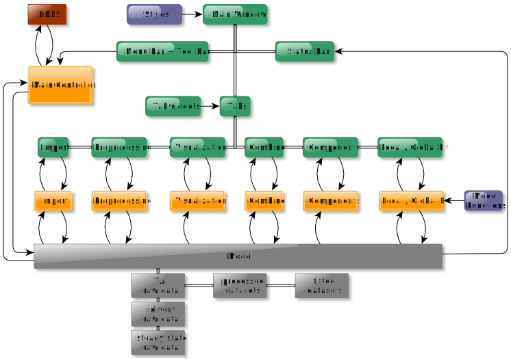

.. _software_architecture:

Software Architecture
=====================

We use a lightweight, MVC-inspired design: the View layer owns basic input handling and hosts our prebuilt tab-widget components, the Model is a minimal signal-emitter with just the stubs needed to notify the UI, and the Controller concentrates all of the complex logic—data analysis, fitting steps, workflow orchestration—so that anyone diving into the code need only look at the Controller to understand what the app really does. This loose separation gives you the benefits of MVC’s mental model without the ceremony of full, multi-class data models and view–model bindings

   An overview of our MVC architecture. The :green:`View (green)` concentrates and validates the user input and informs the :orange:`Controller (orange)`. The controller gets the data from the :gray:`Model (gray)` manipulates it and updates the model. Finally, the model emits a signal catched by the View which updates the GUI. Adapted from *TAPAS: Transient Absorption Processing & Analysis Software*, ChemRxiv preprint, **2025**, DOI: https://doi.org/10.26434/chemrxiv-2025-4d7fh, CC BY 4.0

The corresponding source code folder structure is shown below. 

.. code-block:: text

   _internal/
   ├── assets/
   │   ├── icons
   │   └── model previws
   ├── configurations/
   │   ├── gui input configurations
   │   ├── gui style configurations
   │   ├── messages
   │   ├── plotting configurations
   │   └── logging configurations
   ├── controllers/
   │   ├── main controller
   │   ├── import controller
   │   ├── preprocessing controller
   │   └── ...
   ├── models/
   │   └── model
   ├── utils/
   │   ├── utils
   │   └── model functions
   ├── views/
   │   ├── tabs/
   |   |   ├──import tab
   |   |   ├──preprocessing tab
   |   |   └── ...
   │   ├── tabwidgets/
   |   |   ├──import tabwidgets
   |   |   ├──preprocessing tabwidgets
   |   |   └── ...
   │   └── main window
   └── ...

If the user for example wants to change the import routine to automatically read in their metadata, they would need to adjust the corresponding functions in the import controller module. 
If the user wants to add a different filtering method in the preprocessing step, they would add the corresoponding button in the preprocessing tabwidget module, connect the button to a function in the view module and set the function in the controller module. 

The kinetic models used for local and global fitting can be found under :file:`/utils/model_functions.py`. A detailed instruction on how to add custom models can be found in the :ref:`tutorials section <tut_new_model>`. 
